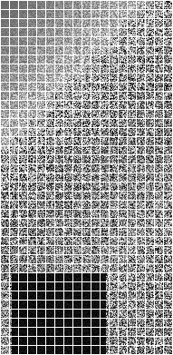

# Mines detection Application DevChallenge XIX Final

_28.10.22 11:30 - 28.10.22 18:30_

## Task:

You can find the task in `task.pdf` file.

## Starting service:

For starting the service enter:

```bash
$ docker-compose up
```
command in the root directory of current project, or open Project with Visual Studio 2022, and run trust-network-compose or Miners.WebAPI project.

## Task realization details:

In my realization all borders around cells is required. Borders around image required too.

In my realization Black is <= 128. White is > 128.

For example with image:


base64 string of which you can find in file `img/test-image-base64.txt`.
And with `min_level = 87` you will get:
```JSON
[
  {
    "x": 0,
    "y": 0,
    "level": 100
  },
  {
    "x": 0,
    "y": 1,
    "level": 100
  },
  {
    "x": 0,
    "y": 2,
    "level": 90
  },
  {
    "x": 1,
    "y": 0,
    "level": 100
  },
  {
    "x": 1,
    "y": 1,
    "level": 95
  },
  {
    "x": 1,
    "y": 30,
    "level": 88
  },
  {
    "x": 1,
    "y": 35,
    "level": 88
  },
  {
    "x": 1,
    "y": 37,
    "level": 88
  },
  {
    "x": 2,
    "y": 0,
    "level": 96
  },
  {
    "x": 2,
    "y": 30,
    "level": 100
  },
  {
    "x": 2,
    "y": 31,
    "level": 100
  },
  {
    "x": 2,
    "y": 32,
    "level": 100
  },
  {
    "x": 2,
    "y": 33,
    "level": 100
  },
  {
    "x": 2,
    "y": 34,
    "level": 100
  },
  {
    "x": 2,
    "y": 35,
    "level": 100
  },
  {
    "x": 2,
    "y": 36,
    "level": 100
  },
  {
    "x": 2,
    "y": 37,
    "level": 100
  },
  {
    "x": 2,
    "y": 38,
    "level": 100
  },
  {
    "x": 3,
    "y": 30,
    "level": 100
  },
  {
    "x": 3,
    "y": 31,
    "level": 100
  },
  {
    "x": 3,
    "y": 32,
    "level": 100
  },
  {
    "x": 3,
    "y": 33,
    "level": 100
  },
  {
    "x": 3,
    "y": 34,
    "level": 100
  },
  {
    "x": 3,
    "y": 35,
    "level": 100
  },
  {
    "x": 3,
    "y": 36,
    "level": 100
  },
  {
    "x": 3,
    "y": 37,
    "level": 100
  },
  {
    "x": 3,
    "y": 38,
    "level": 100
  },
  {
    "x": 4,
    "y": 30,
    "level": 100
  },
  {
    "x": 4,
    "y": 31,
    "level": 100
  },
  {
    "x": 4,
    "y": 32,
    "level": 100
  },
  {
    "x": 4,
    "y": 33,
    "level": 100
  },
  {
    "x": 4,
    "y": 34,
    "level": 100
  },
  {
    "x": 4,
    "y": 35,
    "level": 100
  },
  {
    "x": 4,
    "y": 36,
    "level": 100
  },
  {
    "x": 4,
    "y": 37,
    "level": 100
  },
  {
    "x": 4,
    "y": 38,
    "level": 100
  },
  {
    "x": 5,
    "y": 30,
    "level": 100
  },
  {
    "x": 5,
    "y": 31,
    "level": 100
  },
  {
    "x": 5,
    "y": 32,
    "level": 100
  },
  {
    "x": 5,
    "y": 33,
    "level": 100
  },
  {
    "x": 5,
    "y": 34,
    "level": 100
  },
  {
    "x": 5,
    "y": 35,
    "level": 100
  },
  {
    "x": 5,
    "y": 36,
    "level": 100
  },
  {
    "x": 5,
    "y": 37,
    "level": 100
  },
  {
    "x": 5,
    "y": 38,
    "level": 100
  },
  {
    "x": 6,
    "y": 30,
    "level": 100
  },
  {
    "x": 6,
    "y": 31,
    "level": 100
  },
  {
    "x": 6,
    "y": 32,
    "level": 100
  },
  {
    "x": 6,
    "y": 33,
    "level": 100
  },
  {
    "x": 6,
    "y": 34,
    "level": 100
  },
  {
    "x": 6,
    "y": 35,
    "level": 100
  },
  {
    "x": 6,
    "y": 36,
    "level": 100
  },
  {
    "x": 6,
    "y": 37,
    "level": 100
  },
  {
    "x": 6,
    "y": 38,
    "level": 100
  },
  {
    "x": 7,
    "y": 30,
    "level": 100
  },
  {
    "x": 7,
    "y": 31,
    "level": 100
  },
  {
    "x": 7,
    "y": 32,
    "level": 100
  },
  {
    "x": 7,
    "y": 33,
    "level": 100
  },
  {
    "x": 7,
    "y": 34,
    "level": 100
  },
  {
    "x": 7,
    "y": 35,
    "level": 100
  },
  {
    "x": 7,
    "y": 36,
    "level": 100
  },
  {
    "x": 7,
    "y": 37,
    "level": 100
  },
  {
    "x": 7,
    "y": 38,
    "level": 100
  },
  {
    "x": 8,
    "y": 30,
    "level": 100
  },
  {
    "x": 8,
    "y": 31,
    "level": 100
  },
  {
    "x": 8,
    "y": 32,
    "level": 100
  },
  {
    "x": 8,
    "y": 33,
    "level": 100
  },
  {
    "x": 8,
    "y": 34,
    "level": 100
  },
  {
    "x": 8,
    "y": 35,
    "level": 100
  },
  {
    "x": 8,
    "y": 36,
    "level": 100
  },
  {
    "x": 8,
    "y": 37,
    "level": 100
  },
  {
    "x": 8,
    "y": 38,
    "level": 100
  },
  {
    "x": 9,
    "y": 30,
    "level": 100
  },
  {
    "x": 9,
    "y": 31,
    "level": 100
  },
  {
    "x": 9,
    "y": 32,
    "level": 100
  },
  {
    "x": 9,
    "y": 33,
    "level": 100
  },
  {
    "x": 9,
    "y": 34,
    "level": 100
  },
  {
    "x": 9,
    "y": 35,
    "level": 100
  },
  {
    "x": 9,
    "y": 36,
    "level": 100
  },
  {
    "x": 9,
    "y": 37,
    "level": 100
  },
  {
    "x": 9,
    "y": 38,
    "level": 100
  },
  {
    "x": 10,
    "y": 30,
    "level": 100
  },
  {
    "x": 10,
    "y": 31,
    "level": 100
  },
  {
    "x": 10,
    "y": 32,
    "level": 100
  },
  {
    "x": 10,
    "y": 33,
    "level": 100
  },
  {
    "x": 10,
    "y": 34,
    "level": 100
  },
  {
    "x": 10,
    "y": 35,
    "level": 100
  },
  {
    "x": 10,
    "y": 36,
    "level": 100
  },
  {
    "x": 10,
    "y": 37,
    "level": 100
  },
  {
    "x": 10,
    "y": 38,
    "level": 100
  }
]
``` 
